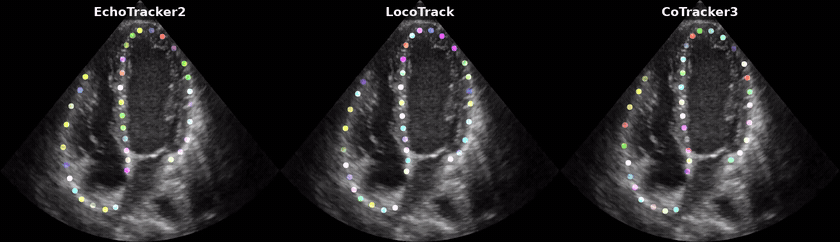

# 🎯 Point Tracking in Echocardiography 🫀

<p align="center">
  
</p>

If you find this work useful, please consider giving the repository a ⭐ — it helps others discover the project and motivates further development!

---
> **This repo contains the official implementations for the following papers:**

## 📄 Papers
| # | Title | Venue | Links |
|---|-------|-------|-------|
| 1 | <h4>EchoTracker2: Enhancing Myocardial Point Tracking by Modeling Local Motion</h4> | **MICCAI 2026 (top 9%)** | <a href="#"></a> <a href="#paper-1"></a> <a href="#"></a> |
| 2 | <h4>Taming Modern Point Tracking for Speckle Tracking Echocardiography via Impartial Motion</h4> | **CVAMD @ ICCV 2025** | <a href="https://openaccess.thecvf.com/content/ICCV2025W/CVAMD/html/Azad_Taming_Modern_Point_Tracking_for_Speckle_Tracking_Echocardiography_via_Impartial_ICCVW_2025_paper.html"></a> <a href="https://arxiv.org/abs/2507.10127"></a> <a href="#"></a> |

---

## 🔧 Installation
 
### Requirements
 
- Python >= 3.10 
- A CUDA-capable GPU with CUDA >= 11.7 — **required, not optional**: every model wrapper in `models/net.py` hardcodes its device to `cuda:<id>` with no CPU fallback, so none of the demos will run on a CPU-only machine
- PyTorch >= 2.0
- ffmpeg (system binary — required by `mediapy` for reading/writing videos; install via your OS package manager, e.g. `apt install ffmpeg`)
 
### Setup
 
Clone the repo and create an isolated environment before installing dependencies — either conda or a plain `venv` works.
 
```bash
git clone https://github.com/riponazad/ptecho.git
cd ptecho

# Option A: conda
conda create -n ptecho python=3.10 -y
conda activate ptecho

# Option B: venv (skip this if you created a conda env above)
python3 -m venv .venv
source .venv/bin/activate   # Windows: .venv\Scripts\activate

pip install -r requirements.txt
```
 
---
 
## 🚀 Usage

### Model weights

Download each checkpoint and place it in the corresponding destination folder before running any demo.

| Model | Checkpoint | Destination |
|---|---|---|
| EchoTracker2 | [`model-0.pth`](#) | `weights/echotracker2/` |
| LocoTrack | [`model-85.pth`](#) | `weights/locotrack/` |
| CoTracker3 | [`model-0.pth`](#) | `weights/cotracker3/` |
| EchoTracker | [`model-0.pth`](#) | `weights/echotracker/` |
| PIPs++ | [`model-0.pth`](#) | `weights/pips2/` |
| SpeckNet | [`model-0.pth`](#) | `weights/specknet/` |


Update the paths in [configs.py](configs.py) if you store weights elsewhere.

---

### Demo 1 — Interactive tracking on a video <a name="paper-1"></a>

A single-window interactive app: play an echocardiography video, pick a query frame, click tracking points, choose one or more models, and watch the results play back side by side — each with an approximate GLS (global longitudinal strain) curve. The comparison video is also saved to `outputs/output.mp4`.

```bash
# Run with the default video (data/input1.mp4)
python demo1.py

# Run with a custom video
python demo1.py --video_path data/input2.mp4

# Choose which models are checked by default when the window opens
python demo1.py --default_models='("EchoTracker2", "PIPs++")'
```

**Controls:**

| Control | What it does |
|---|---|
| **Frame slider** | Jump to any frame — pauses playback and freezes that frame for point selection. |
| **Pause & Select Points** | Freezes on the currently playing frame instead of using the slider. |
| Click on the frame | Places a query point (up to 40). For a meaningful GLS curve, click points *in order* along the myocardial wall (e.g. apex → base). |
| **Clear Points** | Removes all points on the current frame. |
| **Models to run** | Check any subset of the 6 models to compare side by side. |
| **Compute GLS** | On by default; uncheck to skip strain computation and get tracking-only output. |
| **Run Tracking** | Runs the checked models on the selected points and shows the results grid. |

Available models: `EchoTracker2`, `LocoTrack`, `CoTracker3`, `EchoTracker`, `PIPs++`, `SpeckNet`

> GLS here is a simple 2D approximation — percent change in the length of the polyline connecting your query points, relative to the video's first frame — not a substitute for vendor speckle-tracking GLS. It's only meaningful if points are clicked in anatomical order along the wall.

Changing the model or GLS selection after results are shown resets the window back to the playing view, ready for a new selection.

---

### Demo 2 — Quantitative evaluation on annotated data <a name="paper-2"></a>

Loads ground-truth annotated data from `data/lv_sample.pkl` by default, runs each model, and overlays per-model metrics (points within 1/2/4 px, median trajectory error) on the output video saved to `outputs/demo2_output.mp4`.

Three sample files ship with the repo — `data/lv_sample.pkl` (left ventricle), `data/rv_sample.pkl` (right ventricle), and `data/camus_sample.pkl` (CAMUS dataset).

```bash
# Run with all models on the default sample (LV)
python demo2.py

# Run with specific models only
python demo2.py --model_names='("EchoTracker2", "EchoTracker")'

# Run on a different annotated pickle file
python demo2.py --data_path data/rv_sample.pkl

# Choose a specific query frame (default: 72% into the sequence)
python demo2.py --q_frame 20
```

`data_path` must point to a pickle file whose `frames`, `trajs`, and `visibility` entries follow the same layout as the shipped sample files (each with a leading batch dimension) — see `demo2.py` for the exact tensor shapes it expects. Note this differs from the `Dataset` format used for training, below. The corner label on the output video defaults to a name derived from `data_path` (e.g. `lv_sample.pkl` → "LV"); override it with `--overlay_label`.

---

## 🏋️ Training / Fine-tuning

> **Note:** The echocardiography datasets used in our papers are not publicly available due to patient privacy restrictions. However, you are welcome to train or fine-tune any model on your own annotated data by following the instructions below.

### Data format

Your PyTorch `Dataset` must return three tensors per sample:

| Tensor | Shape | Description |
|--------|-------|-------------|
| `frames` | `[T, H, W, C]` | Video frames, uint8 or float, values in `[0, 255]` |
| `trajs` | `[T, N, 2]` | Point trajectories, `(x, y)` normalized to `[0.0, 1.0]` |
| `visibs` | `[T, N]` | Visibility mask — `1` if the point is visible, `0` otherwise |

where `T` = number of frames, `N` = number of tracked points.

### Example: training EchoTracker2 from scratch

```python
from torch.utils.data import DataLoader
from models.net import ECHOTRACKER2

# ------------------------------------------------------------------
# 1. Build your dataset — must return (frames, trajs, visibs)
# ------------------------------------------------------------------
class MyEchoDataset(torch.utils.data.Dataset):
    def __init__(self, root, split):
        ...  # load your file list

    def __getitem__(self, idx):
        frames  = ...  # torch.Tensor [T, H, W, C], float, [0, 255]
        trajs   = ...  # torch.Tensor [T, N, 2],    float, [0.0, 1.0]
        visibs  = ...  # torch.Tensor [T, N],        float, {0, 1}
        return frames, trajs, visibs

train_set = MyEchoDataset(root="data/custom", split="train")
val_set   = MyEchoDataset(root="data/custom", split="val")

dataloaders  = {
    "train": DataLoader(train_set, batch_size=4, shuffle=True,  num_workers=4),
    "val":   DataLoader(val_set,   batch_size=4, shuffle=False, num_workers=4),
}
dataset_size = {"train": len(train_set), "val": len(val_set)}

# ------------------------------------------------------------------
# 2. Instantiate and train
# ------------------------------------------------------------------
model = ECHOTRACKER2(device_ids=[0])

model.train(
    dataloaders=dataloaders,
    dataset_size=dataset_size,
    log_dir="outputs/logs/echotracker2",
    ckpt_path="weights/echotracker2_custom",
    epochs=50,
    q_frame=0,   # 0 = track forward from first frame
                 # -1 = use 75% frame, -2 = random frame each batch
)
```

Checkpoints are saved automatically under `ckpt_path/val/` (best loss) and `ckpt_path/val/best_davg/` (best average positional accuracy). TensorBoard logs are written to `log_dir`.

### Fine-tuning from pretrained weights

Pass `ft_model=True` so the loader reads the checkpoint with flexible key matching, then call `load(..., eval=False)` before training:

```python
model = ECHOTRACKER2(device_ids=[0], ft_model=True)
model.load(path="weights/echotracker2/checkpoint.pth", eval=False)

model.train(
    dataloaders=dataloaders,
    dataset_size=dataset_size,
    log_dir="outputs/logs/echotracker2_ft",
    ckpt_path="weights/echotracker2_ft",
    epochs=20,
)
```

---
 
## 📝 Citation
 
If you find our work useful, please consider citing **both** of the papers this repo implements:
 
```bibtex
@inproceedings{author2026echotracker2,
  title     = {EchoTracker2: Enhancing Myocardial Point Tracking by Modeling Local Motion},
  author    = {Last, First and Last, First},
  booktitle = {MICCAI},
  year      = {2026}
}
 
@InProceedings{Azad_2025_ICCV,
    author    = {Azad, Md Abulkalam and Nyberg, John and Dalen, Havard and Grenne, Bj{\o}rnar and Lovstakken, Lasse and {\O}stvik, Andreas},
    title     = {Taming Modern Point Tracking for Speckle Tracking Echocardiography via Impartial Motion},
    booktitle = {Proceedings of the IEEE/CVF International Conference on Computer Vision (ICCV) Workshops},
    month     = {October},
    year      = {2025},
    pages     = {1115-1124}
} 
```

### Citing individual models

This repo also bundles several point-tracking models as baselines. If your work specifically uses one of them, please **additionally** cite its original paper:

| Model | Original paper |
|---|---|
| `EchoTracker2`, `SpeckNet` | Already covered by the two papers above |
| `EchoTracker` | Azad et al., *EchoTracker: Advancing Myocardial Point Tracking in Echocardiography*, MICCAI 2024 — [repo](https://github.com/riponazad/echotracker) |
| `LocoTrack` | Cho et al., *Local All-Pair Correspondence for Point Tracking*, ECCV 2024 — [repo](https://github.com/cvlab-kaist/locotrack) |
| `CoTracker3` | Karaev et al., *CoTracker3: Simpler and Better Point Tracking by Pseudo-Labelling Real Videos*, ICCV 2025 — [repo](https://github.com/facebookresearch/co-tracker) |
| `PIPs++` | Zheng et al., *PointOdyssey: A Large-Scale Synthetic Dataset for Long-Term Point Tracking*, ICCV 2023 — [repo](https://github.com/aharley/pips2) |
 
---
 
## 📜 License

This project uses a multi-license structure due to third-party code inclusion.

| Component | License |
|---|---|
| Original code (EchoTracker, EchoTracker2, SpeckNet, demos, utils) and all model weights/checkpoints released from this repository | [CC BY-NC 4.0](LICENSE) |
| CoTracker3 integration code (`models/cotracker3.py`, `models/cotracker/`) — [source](https://github.com/facebookresearch/co-tracker) | [CC BY-NC 4.0](https://github.com/facebookresearch/co-tracker/blob/main/LICENSE.md) |
| LocoTrack integration code (`models/locotrack.py`) — [source](https://github.com/cvlab-kaist/locotrack) | Apache License 2.0 |
| PIPs++ integration code (`models/pips2.py`) — [source](https://github.com/aharley/pips2) | MIT License |

This project's original code and model weights are free to use for **noncommercial purposes only** (e.g., academic research, education, personal projects), with attribution. This covers all checkpoints released from this repository, including the fine-tuned LocoTrack, CoTracker3 and PIPs++ checkpoints produced by this project — see [Model weights](#model-weights). **Commercial use is not permitted under this license.** If you wish to use this project's code or weights for commercial purposes, you must obtain a separate commercial license agreement. Commercial licensing is handled by NTNU Technology Transfer AS (NTNU TTO) — you can reach out to them directly, or contact md.a.azad@ntnu.no or andreas.ostvik@ntnu.no, who will coordinate with NTNU TTO.

If you use other, third-party pretrained models alongside this project (e.g., a base LocoTrack, CoTracker3 or PIPs++ checkpoint from its original source), check that model's own license terms separately — they are not covered by this project's license.

When using this project, retain the respective license notices for each component. See the [`LICENSE`](LICENSE) file for full terms.
